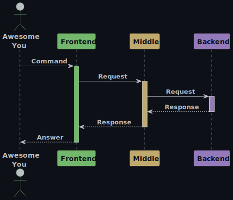
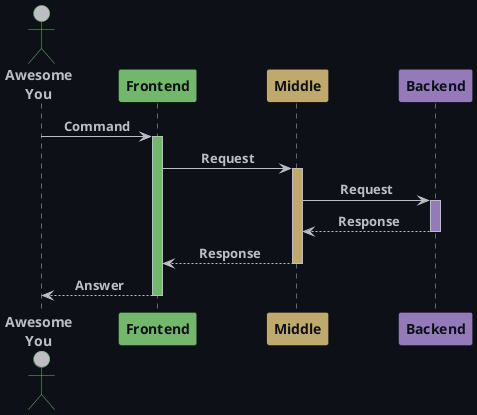

<div style="text-align: center;">
    
</div>
<h1><a name="up">Middle-сервис // Middle</a></h1>

Часть приложения `Мини-банк` − middle-сервис, который будет принимать запросы пользователя,
выполнять бизнес-логику, маршрутизировать запросы в банк и возвращать ответ.

---

## Как запустить

Для запуска приложения нужно:
1. Склонировать проект:
```
git clone https://github.com/gpb-it-factory/molchanova-middle-service
```
#### Запуск с помощью консоли
2. Открыть консоль и перейти в директорию проекта
   (в папку `molchanova-middle-service`).
3. Собрать проект, прописав следующую команду:
    - Windows:
   ```
   ./gradlew.bat build
   ```
    - Linux/Mac:
   ```
   ./gradlew build
   ```
4. Запустить проект, прописав следующую команду (для Spring Boot приложения):
    - Windows:
   ```
   ./gradlew.bat bootRun
   ```
    - Linux/Mac:
   ```
   ./gradlew bootRun
   ```
   **Готово!**

#### Запуск с помощью IDEA
2. Открыть в IDEA проект (папку `molchanova-middle-service`).
3. Запустить проект из IDEA, нажав волшебную кнопочку. \
   **Готово!**

## Общая архитектура
### Описание

#### 1. Frontend
Telegram-бот. Клиентское приложение, инициирует запросы пользователей.

#### 2. Middle
Java-сервис. Принимает запросы от пользователя, выполняет валидацию и бизнес-логику, маршрутизирует их в `Backend` и отправляет ответ.

#### 3. Backend
Автоматизированная банковская система. Обрабатывает транзакции, хранит клиентские данные.

### Схема
Описание архитектуры можно представить в виде краткой схемы ниже:\
\


<details>
<summary>Код PlantUML схемы</summary>



</details>

## Планы на будущее
- Добавить возможность перевода

## Контакты
Связаться со мной можно через:
- [GitHub](https://github.com/molchmd): molchmd
- [Telegram](https://t.me/molchmd): @molchmd

---

[](#up)